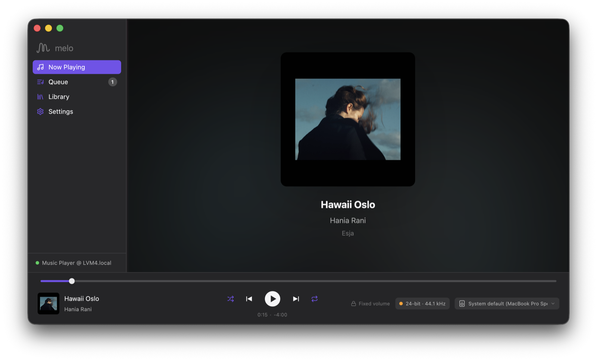

# Melo for Mac

A native macOS client for [MPD](https://www.musicpd.org) (Music Player Daemon), written in Rust
with [GPUI](https://www.gpui.rs) — Zed's GPU-accelerated UI framework. Melo never plays audio
itself: it controls an MPD server over TCP (port 6600) — on this Mac (Homebrew `mpd`) or anywhere
on the network — and shows you honestly what happens to the signal on the way to your DAC.



It started life as a port of the SwiftUI Melo app (`Melo-macOS` in the Melo monorepo) and now
stands alone; the MPD client is a hand-rolled implementation of the ~24 commands the app needs.

## Install

Requires macOS 14 (Sonoma) or later; developed on Apple silicon (Intel builds are untested). There are no binary releases yet
(signed/notarized builds, a Homebrew cask and in-app updates are on the TODO list), so build it
from source — it takes a few minutes the first time:

```bash
# 1. Rust toolchain (one-time), if you don't have it
curl --proto '=https' --tlsv1.2 -sSf https://sh.rustup.rs | sh -s -- -y
source "$HOME/.cargo/env"

# 2. Build Melo.app
git clone https://github.com/Melo-MPD/melo-gpui.git
cd melo-gpui
scripts/bundle.sh                 # → target/Melo.app

# 3. Install
cp -R target/Melo.app /Applications/
open /Applications/Melo.app
```

Xcode Command Line Tools are needed for the linker and `sips`/`iconutil` (`xcode-select --install`);
the full Xcode and its Metal Toolchain are **not** required. The bundle is ad-hoc signed, which is
fine for a locally built app; the first launch asks for local-network access so Melo can find
MPD servers via Bonjour.

You also need an MPD server to talk to. For one on this Mac:

```bash
brew install mpd
# edit ~/.config/mpd/mpd.conf (music_directory, an `audio_output { type "osx" … }` block),
# or let Melo do it: Settings › Local MPD picks the output device and writes that block for you.
brew services start mpd            # listens on 127.0.0.1:6600
```

Melo auto-connects to the last server it used, or to the first one Bonjour finds; add remote
servers (host, port, password) under Settings › Add Server. Support and bug reports:
[github.com/Melo-MPD/support](https://github.com/Melo-MPD/support).

## Build & run (development)

```bash
cargo run            # debug build, opens the window
cargo test           # protocol / parser / binary-assembly / library-index / signal-path tests
cargo test live_session -- --ignored --nocapture   # smoke test against mpd on 127.0.0.1:6600
scripts/bundle.sh    # release build → target/Melo.app (ad-hoc signed, with .icns)
```

Build notes:

- Uses `gpui = "0.2.2"` from crates.io with the **`runtime_shaders`** feature, so
  the Metal shaders are compiled at launch and you do **not** need Xcode's Metal
  Toolchain download (`xcodebuild -downloadComponent MetalToolchain`). Precompiling
  them for release is on the TODO list.
- `cargo run` runs the bare binary from `target/`; Bonjour and local-network access
  work fine that way when launched from a terminal. `scripts/bundle.sh` makes a proper
  `Melo.app` (bundle id `com.liborvanc.melo.mac`).
- First build is a few minutes (GPUI + deps); incremental builds are seconds.
- Debug env vars: `MELO_SCREEN=queue|library|settings` opens that screen at launch,
  `MELO_PERF=1` prints the perf probes described below.
- User data: `~/Library/Application Support/Melo/profiles.json` (server profiles — passwords
  in plaintext for now, Keychain is a TODO), `~/Library/Caches/Melo/coverArt/`.

## Features

| Screen | Status |
|---|---|
| Sidebar (Now Playing / Queue / Library / Settings, queue badge, connection dot) | ✅ |
| Transport bar: local-first seek (one `seekcur` on release, optimistic hold ≤3 s), shuffle / prev / play-pause / next / repeat cycle (off→all→one), elapsed · −remaining, volume, Signal Path pill, Outputs pill, server name | ✅ |
| Now Playing: blurred art backdrop + scrim, 272 pt art, title / artist / album | ✅ |
| Queue: rows with waveform / track no., click → `playid`, Clear, empty state | ✅ |
| Library: album grid with search + refresh; album detail with Play / Add to Queue; track click → clear + add + play; per-album art | ✅ |
| Settings: Nearby servers (Bonjour `_mpd._tcp`), active connection + Disconnect, saved profiles (Connect / Remove), Add Server form, Playback (Consume, Crossfade, ReplayGain, MixRamp), Audio (bit-perfect mode), Local MPD editor | ✅ |
| Keyboard: Space, ⌘← ⌘→, ⌘↑ ⌘↓, ⌘1/2/3, ⌘, ; Playback / View / Edit menus | ✅ |
| Auto-connect: last-used server on launch, else first Bonjour server within 3 s | ✅ |
| Reconnect with `min(2^n, 30)` s backoff, driven from the idle socket; sleep/wake recovery | ✅ |
| Light / dark appearance | ✅ (follows the window appearance) |
| Outputs picker, Signal Path, bit-perfect mode, Local MPD audio setup | ✅ (see below) |
| Menu-bar extra | ❌ GPUI has no `NSStatusItem` support |
| Passwords in Keychain | ❌ stored in `profiles.json` for now |

## Audio: outputs, Signal Path, bit-perfect

Melo never touches audio — MPD does — so this is split honestly in two:

**From any server (protocol only):**
- **Output button** (speaker, transport bar) → list of MPD outputs. Click a row to *route* playback there
  (enables it, disables the rest); the switch adds/removes outputs MPD-style. ALSA outputs get a **DoP**
  switch (`outputset dop`) and show `allowed_formats`.
- **Signal Path pill** (replaces the plain format badge; green = Bit-perfect, blue = Lossless, amber =
  Altered) → Source (`Format:` tag + bitrate) → Decoder (`status.audio`) → Processing (ReplayGain,
  crossfade, MixRamp, volume) → Output, plus one-click fixes. Anything only knowable from the server's
  `mpd.conf` is listed under "not verifiable" instead of being guessed.
- **Bit-perfect mode** (Settings › Audio, or in the pill): `replay_gain_mode off`, `crossfade 0`,
  `mixrampdelay nan`, `setvol 100`; the volume slider becomes a lock, ⌘↑/⌘↓ are ignored, and if another
  client drifts the server the pill turns amber with **Re-apply**.

**For the Homebrew MPD on this Mac (Settings › Local MPD):** pick the CoreAudio device (your DAC),
**Exclusive access** (`hog_device`, recommended for USB/Thunderbolt DACs — MPD holds the device while
its output is enabled), **DoP**, **Volume control** None / Hardware / Software (`mixer_type`), and clear
`volume_normalization` / `audio_output_format`. Bluetooth / AirPlay devices automatically get no hog and
a pinned `format "44100:24:2"` (CoreAudio rejects other rates there — that's the `-10851` failure).
**Save & Restart MPD** rewrites `mpd.conf` structure-preservingly and restarts the daemon (SIGTERM →
SIGKILL if it hangs; SIGHUP doesn't reload outputs).

**Sleep/wake:** macOS re-enumerates USB DACs on wake and MPD keeps its old exclusive (hog) claim, so
every open fails with `OSStatus 560947818` (`!hog`) until MPD is restarted. Melo listens for
`NSWorkspaceDidWakeNotification`, reconnects its own sockets, and cycles the enabled local osx outputs
(`disableoutput` → `enableoutput`) so the DAC is released and re-acquired — no restart. If the error
ever shows up anyway, the Signal Path offers **Re-open <output>**.

The Signal Path asks CoreAudio directly (tiny FFI, polled every 2 s) for the device behind each enabled
output: transport, *current* and *maximum* sample rate, and whether it is hogged — so it can say
"Bluetooth: re-encoded", "CoreAudio downsamples 192 → 96 kHz — Scarlett tops out at 96 kHz", or
"exclusive ✓". MPD's `osx` plugin syncs the DAC to the source rate and never resamples itself, so
*wired DAC · Exclusive on · Volume None · no DSP · source ≤ device max* is a bit-perfect chain. MPD
never restores a device's rate when it lets go, so Audio MIDI Setup showing a device "parked" at
96/192 kHz afterwards is harmless.

## Benchmarking against the SwiftUI app

Both apps carry opt-in probes (`MELO_PERF=1`): `perf first_window <ms>`, `perf first_status <ms>` and a
once-per-second main-thread stall summary (`perf frames {...}`, an 8 ms timer whose late wake-ups
reveal UI-thread stalls). `scripts/perf/bench.sh` drives either app through the same scenario
(idle → Queue scroll → Library scroll + album → resize ×5 → appearance toggle ×2), samples CPU/RSS
every 0.5 s per phase, snapshots `footprint`, optionally records a Time Profiler trace, and writes
JSON per run; `scripts/perf/report.py` renders `perf-out/report.md` with medians side by side.

```bash
# from a Terminal that has Accessibility permission (synthetic input + window moves)
scripts/perf/bench.sh gpui 5             # cargo build --release, 5 runs
MELO_SWIFT_ROOT=~/Repos/melo scripts/perf/bench.sh swift 5   # SwiftUI app from the monorepo checkout
scripts/perf/bench.sh gpui 3 --trace     # + xctrace Time Profiler during the scroll phase
scripts/perf/report.py                   # → perf-out/report.md
```

Fairness rules baked in: release builds only, same window size (1100×720 at 100,100), same local
server, dark mode, one warm-up run recommended (art cache), plug in power and close other apps.
`--no-input` runs the phases without synthetic input (plumbing check).

## Layout

```
src/
  main.rs            Application setup: assets, key bindings, menus, window
  actions.rs         GPUI actions (TogglePlayPause, NextTrack, …)
  assets.rs          Embedded Lucide SVG icons via AssetSource
  theme.rs           light/dark palette (macOS-ish system colours)
  perf.rs            MELO_PERF probes; dock_icon.rs rounds the app icon at runtime
  mpd/               protocol builders, parser, blocking connection (line + binary framing),
                     client (command / idle / art threads → typed events), Bonjour discovery
  state/             AppState entity (player + queue + connection + library + outputs),
                     signal_path (verdict engine), local_mpd (mpd.conf editor + restart),
                     coreaudio (device FFI), power (sleep/wake), cover cache, LibraryIndex,
                     profile persistence, app_dirs
  ui/                root (sidebar + detail + transport bar), screens, popovers, about
  ui/widgets/        slider (custom Element), text_input (EntityInputHandler), toggle,
                     segmented, stepper, popover, buttons
scripts/             bundle.sh (Melo.app), perf/ (benchmark harness)
```

Threading model: MPD I/O runs on plain `std::thread`s with blocking sockets
(three per session: command / idle / cover art). Threads push `MpdEvent`s into a
`futures` channel; a single `cx.spawn` task on GPUI's foreground executor
applies them to the `AppState` entity, and views observe that entity.

## Notes / findings while porting from SwiftUI

- GPUI has no built-in text field or slider; both are ~200–450 lines of custom
  element code here (`ui/widgets/`). Everything else was plain `div()` styling.
- Images: hand GPUI an `Arc<gpui::Image>` (encoded bytes) and it decodes on a
  background thread and caches by content hash — no manual texture management.
- `uniform_list` needs fixed row heights; the album grid is a list of rows of
  2 fixed-width cells rather than an adaptive grid.
- The blurred Now Playing backdrop is pre-blurred on the CPU (`image` crate,
  96×96 → `fast_blur`) because GPUI has no backdrop-blur filter.
- No `NSStatusItem`, `NSOpenPanel` or Keychain wrappers in GPUI itself; those
  would need `objc2` / `security-framework` directly.

## License

[MIT](LICENSE) — © 2026 Libor Vanc.
